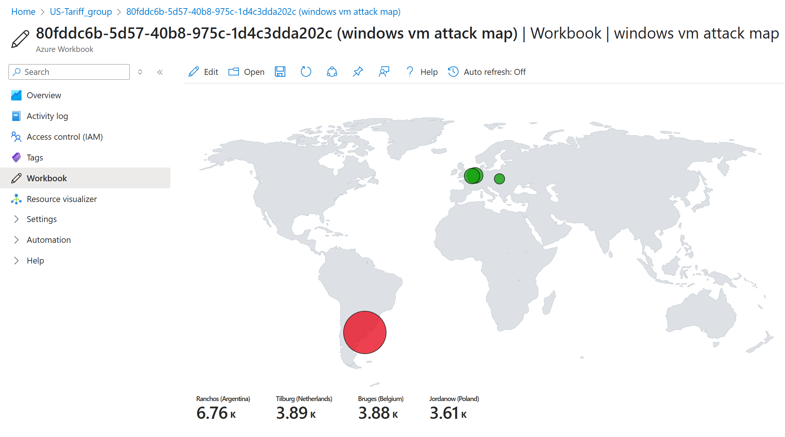
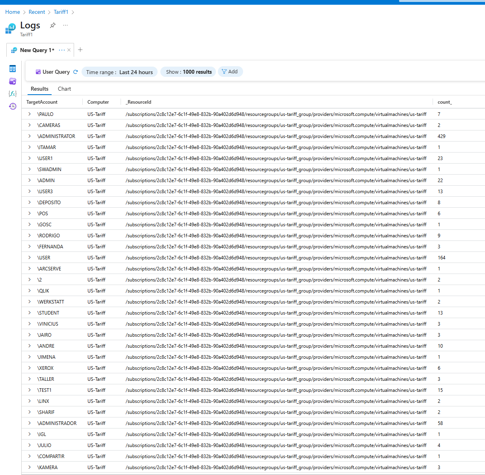

# 🛡️ Azure Security Monitoring Lab

This project demonstrates a hands-on lab using **Microsoft Azure** to deploy, monitor, and secure a virtual machine using tools like **Log Analytics**, **Microsoft Sentinel**, and **Network Security Groups (NSGs)**.

---

## 📌 Project Overview

| Component              | Value                                      |
|------------------------|--------------------------------------------|
| **Virtual Machine**    | `Doge`                                     |
| **Resource Groups**    | `Doge-Data-bank-gov`, `NetworkWatcherRG`   |
| **Log Analytics**      | `DogeLog`                                  |
| **SIEM**               | Microsoft Sentinel (`SecurityInsights`)    |
| **Virtual Network**    | `Doge.net`                                 |
| **NSG**                | `Doge-nsg`                                 |
| **Dashboard**          | Custom Azure Workbook                      |

---

## 📸 Screenshots

### 🌍 Virtual Machine Monitoring Map – Azure Workbook

> *Demonstrates inbound and outbound traffic filtering configured for the `Doge-nsg`.*

---
### 🗂️ Resource Group Overview – US-Tariff_group

### 🔍 Azure Log Analytics Query View

## 🧠 Skills & Tools Used

- **SIEM Monitoring** with Microsoft Sentinel  
- **Threat Analytics** using Azure Workbooks  
- **Log Querying** in Azure Log Analytics  
- **VM Deployment & Networking** in Azure Portal  
- **Network Security Management** using NSG rules  

---

## 💬 TryHackMe & Learning Context

This project was completed as part of my self-paced cybersecurity training through:
- 🧠 **TryHackMe**: SOC Level 1 / Azure Fundamentals  
- 🎓 **WGU Cybersecurity Program**

---

## 🔗 Connect

- 💼 LinkedIn: [linkedin.com/in/romulo-velasco-112ab9335](https://www.linkedin.com/in/romulo-velasco-112ab9335/)
- 🧠 GitHub: [github.com/Manny0882](https://github.com/Manny0882)
