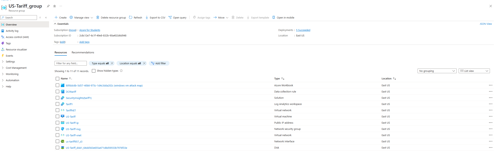

# azure-security-lab
Hands-on Azure project for monitoring and securing a virtual machine using Microsoft Sentinel and Log Analytics
# Azure Security Monitoring Lab 🛡️

This is a hands-on cybersecurity lab built using Microsoft Azure.

## 🔧 Project Overview
- **Virtual Machine**: `Doge`
- **Resource Groups**: `Doge-Data-bank-gov`, `NetworkWatcherRG`
- **Log Analytics Workspace**: `DogeLog`
- **SIEM**: Microsoft Sentinel (`SecurityInsights(dogelog)`)
- **Virtual Network**: `Doge.net`
- **Network Security Group**: `Doge-nsg`
- **Dashboard**: Custom Azure Workbook

## 📸 Screenshot
## 📸 Screenshot

## 💡 Skills Used
- Cloud Monitoring
- Threat Detection
- Network Security
- Azure Resource Management

## 🔗 TryHackMe & Learning Tools
This project was part of my practical cybersecurity training with TryHackMe and WGU.
